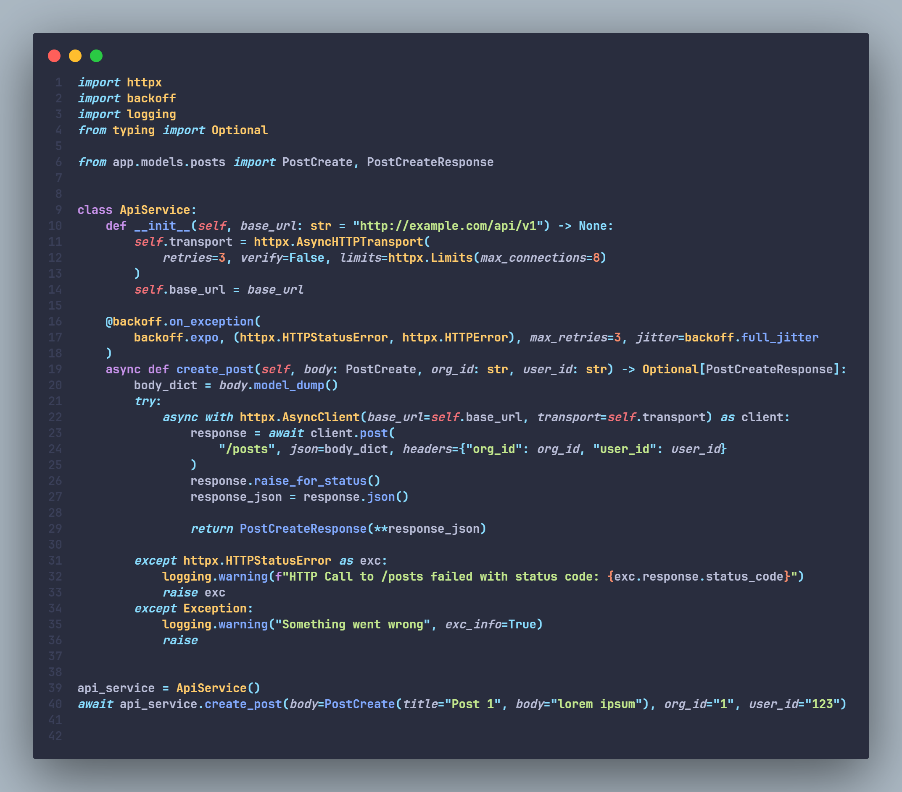
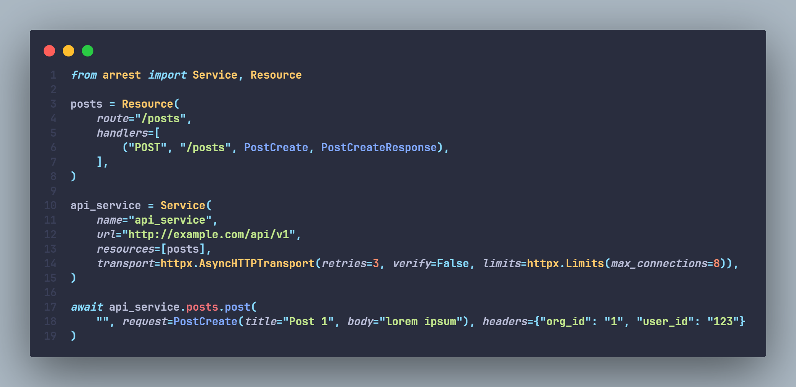

<h1 align="center" style="font-size: 3rem; margin: 0">
Arrest
</h1>

---

<div align="center">
    <p>
        <a href="https://pepy.tech/projects/arrest">
            
        </a>
        <a href="https://github.com/s-bose/arrest/actions/workflows/tests.yml">
            
        </a>
        <a href="https://codecov.io/github/s-bose/arrest">
            
        </a>
        <a href="https://pypi.python.org/pypi/arrest">
            
        </a>
        <a href="https://www.codefactor.io/repository/github/s-bose/arrest">
            
        </a>
        <a href="https://github.com/s-bose/arrest">
            
        </a>
        <a href="https://github.com/s-bose/arrest/blob/master/LICENSE">
            
        </a>
    </p>
</div>

---


Enable data validation for REST APIs.

Arrest is an HTTP client library with an easy and declarative way of defining, managing, and calling RESTful HTTP APIs with type validation, retries, exception handling, and other batteries included.

Arrest lets you define your RESTful API services in a simple encapsulation that takes care of the following:
1. Type validation for request and response data
2. HTTP request retries
3. Manage your services definitions in one place
4. Exception handling
5. Hooks for custom exceptions
6. Callbacks
7. Automatic code generation from OpenAPI Schema

Here is an example of a typical client-side functions for interacting with an HTTP Service.


And here is the same functionality achieved using Arrest.


## Installation

### using `pip`
```shell
$ pip install arrest
```

### using `poetry`
```shell
$ poetry add arrest
```

### using `github`
```shell
$ pip install git+https://github.com/s-bose/arrest.git@master
```


## Philosophy of Arrest

Arrest was made as a result of the repeated boilerplate that comes with managing different internal / external services.

Imagine you have to call an HTTP server `http://example.com/api/v1` from your python code. For just a single GET api call we have a rather simple solution, make a method around the HTTP call.

```python
import httpx

async def get_posts(url: str = "http://example.com/api/v1"):
    async with httpx.AsyncClient() as client:
        try:
            response = await client.get(url)
            response.raise_for_status()
            return response.json()
        except httpx.HTTPStatusError as exc:
            logging.warning(f"something went wrong, {exc.response.status_code}")
            return exc.response.json()
```

The problem arises when you have more than one method, and more than one endpoint to consider. We could create a sophisticated class containing the list of available endpoints and the methods. But it is a lot of boilerplate in trying to do something as simple as communicating with an HTTP server, even more so when we have multiple servers to interact with, e.g, in a microservice architecture.

Arrest attempts to simplify this by letting you create a single configuration using `services` and `resources` and `handlers` which creates a complete unit that can be used anywhere.

Just define your service, i.e, the main server url, and a set of resources, e.g, `/users`, `/articles`.
We assume the RESTful apis provided by the service are [resource-oriented](https://cloud.google.com/apis/design/resources#resources).

```python
from arrest import Service, Resource

user_resource = Resource(
    name="users",
    route="/users",
    handlers=[
        ("GET", "/"),
        ("GET", "/{user_id:str}"),
        ("POST", "/", NewUserRequest),
        ("PATCH", "/{user_id:str}", UpdateUserRequest)
    ]
)

example_svc = Service(
    name="example",
    url="http://example.com/api/v1",
    resources=[user_resource]
)
```

Now that our service is configured we can simply use `example_svc` anywhere we want to use its functionalities.

```python

await example_svc.users.get("/")
await example_svc.users.get("/59e66b94-9d94-4380-8101-c0ebf60bbff4")
await example_svc.users.post("/", request=NewUserRequest(email="abc@email.com", password="hopefullyhashed"))
await example_svc.users.patch("/", request=UpdateUserRequest(password="hopefullyhashedagain"))
```

You might also have noticed that a custom request DTOs can be provided such as `NewUserRequest` and `UpdateUserRequest`. With this you can enable data validation and structure to your request data. Although as of now these have to be pydantic classes.

## Caveats and Future

Arrest is still in its infancy. There are a lot of new features we would love to integrate in future. But there are certain caveats and assumptions that Arrest makes which are important to know.

1. It currently only supports JSON as both request and response. So if your service does not deal with JSON then probably you have to do it the old way.
2. It follows the resource-oriented REST api design. If your service does not have clear distinction for different resources and CRUD methods to access them then it might be a bit wonky to integrate it properly within Arrest.

All things considered, it is still a work in progress, and we would greatly appreciate if you find any bugs and notify us in the issue-tracker.
